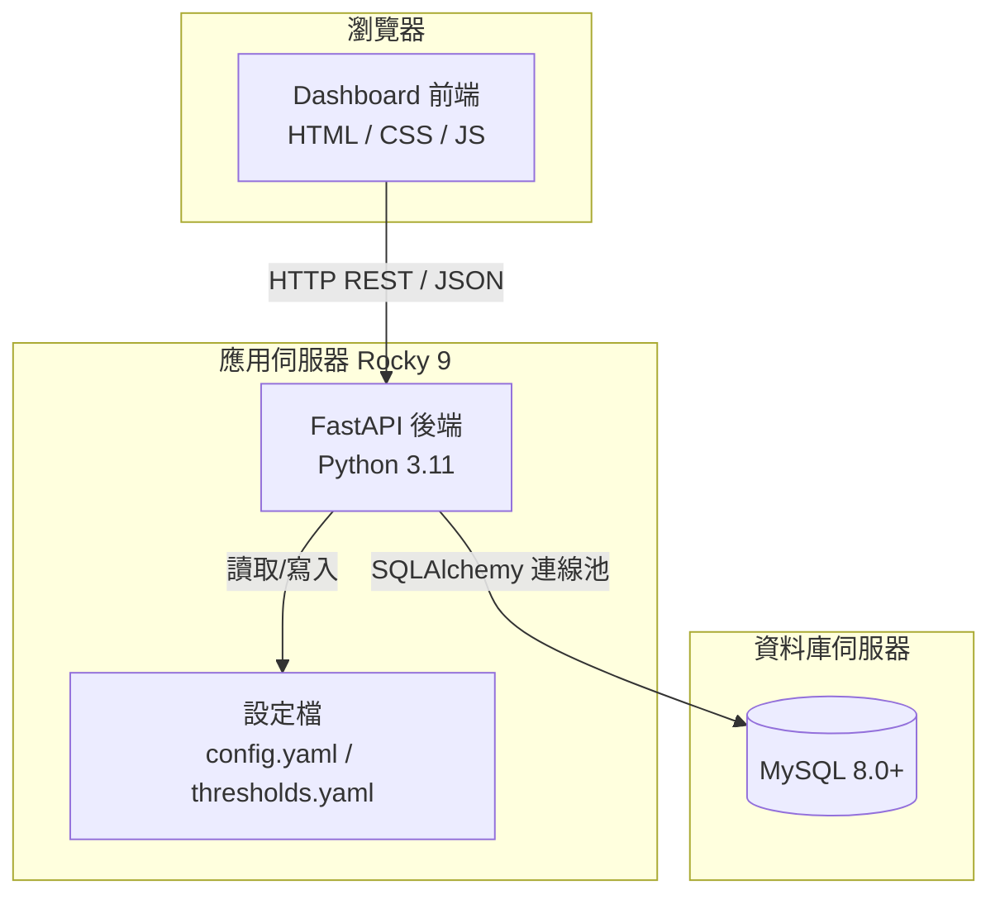
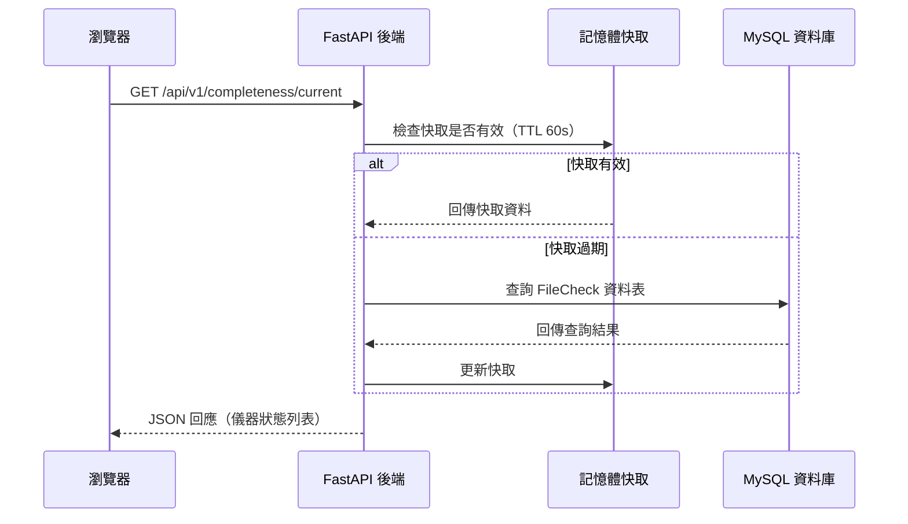

# 技術設計文件：雷達監控整合平台

## Overview

雷達監控整合平台是一套前後端分離的網頁應用系統，部署於 Linux Rocky 9 環境。後端以 Python（FastAPI）提供 REST API，前端以純 HTML/CSS/JavaScript 實作 Dashboard，資料來源為 MySQL 資料庫。系統核心功能包括：

- 即時顯示本地時間與 UTC 時間（每秒更新）
- 各儀器資料時間差視覺化呈現（以顏色區分嚴重程度）
- 電腦系統狀態監控（CPU、記憶體、磁碟，三段燈號警示）
- 儀器歷史資料時序圖（DiffTime + 同 IP 電腦指標）
- 自動刷新機制（60 秒週期）
- 儀器閾值管理（資料週期 T 設定，自動計算三段門檻）

資料異常的主動推播通知由外部系統負責，本平台僅負責視覺化呈現。

---

## Architecture

### 整體架構圖



### 資料流程圖



### 部署架構

- 作業系統：Linux Rocky 9
- Python 版本：3.11+
- 後端框架：FastAPI + Uvicorn（ASGI）
- 前端：靜態檔案，由 Nginx 或 FastAPI StaticFiles 提供服務
- 資料庫：MySQL 8.0+（外部既有資料庫，唯讀存取）
- 程序管理：systemd service

---

## Components and Interfaces

### 後端元件

Backend 是前端與資料庫之間的橋樑，負責查詢並以 REST API 回傳結果。

#### 資料存取層（database.py）

管理 SQLAlchemy 連線池，統一對三個 MySQL 資料庫的唯讀存取：

- `file_status`：儀器檔案狀態
- `system_status`：電腦系統狀態
- `disk_status`：磁碟使用率

```python
def get_engine(db_name: str) -> Engine
def get_session(db_name: str) -> Generator[Session, None, None]
def check_connection(db_name: str) -> bool
```

#### 業務邏輯層（services/）

##### alert_service.py — 儀器時間差查詢與閾值管理

```python
def get_all_instrument_statuses() -> list[InstrumentStatus]
def get_instrument_thresholds(file_type: str) -> tuple[float, float, float]
def set_instrument_thresholds(file_type: str, interval_minutes: float) -> None
def set_instrument_thresholds_direct(file_type: str, yellow: float, orange: float, red: float) -> None
def calculate_thresholds(interval_minutes: float) -> tuple[float, float, float]
def list_instruments() -> list[dict]
```

##### system_service.py — 系統負載與磁碟狀態查詢

```python
def get_system_status() -> list[dict]
def get_disk_status() -> list[dict]
def get_combined_status() -> tuple[list[dict], bool]
```

##### history_service.py — 歷史資料查詢

```python
def get_instrument_history(file_type: str, ip: str, range: str) -> dict
def get_system_history(ip: str, range: str) -> dict
```

#### API 層（routers/）

| 端點 | 方法 | 說明 |
|------|------|------|
| `/api/v1/completeness/current` | GET | 取得所有儀器即時狀態 |
| `/api/v1/instruments` | GET | 取得儀器清單與閾值 |
| `/api/v1/instruments/{file_type}/threshold` | PUT/POST | 更新儀器閾值 |
| `/api/v1/system/current` | GET | 取得電腦系統負載 |
| `/api/v1/disk/current` | GET | 取得磁碟使用率 |
| `/api/v1/computers/current` | GET | 取得電腦綜合狀態（含磁碟） |
| `/api/v1/history/{file_type}` | GET | 取得儀器 DiffTime 歷史 |
| `/api/v1/history/system` | GET | 取得電腦系統歷史 |

### 前端元件

| 頁面 | 檔案 | 說明 |
|------|------|------|
| 首頁 | `index.html` + `clock.js` | 導覽頁，各功能入口 |
| 儀器即時狀況 | `instruments.html` + `dashboard.js` | 依科別分組，異常儀器直接顯示，正常儀器折疊為綠色摘要方框；頂部有科別篩選列 |
| 儀器歷史資料 | `history.html` + `history.js` | 點擊儀器卡片後在新分頁開啟，顯示 DiffTime 時序圖（含閾值線）及同 IP 電腦指標時序圖 |
| 電腦即時狀況 | `computers.html` + `computers.js` | 依科別分組，三段燈號顯示 CPU/記憶體/磁碟警示 |
| 儀器閾值設定 | `settings.html` + `settings.js` | 設定資料週期 T 或直接設定三段閾值 |

---

## 專案目錄結構

```
radar-monitoring-platform/
├── backend/
│   ├── main.py                  # FastAPI 應用程式進入點
│   ├── config.py                # 設定檔載入模組
│   ├── database.py              # SQLAlchemy 連線池管理
│   ├── models.py                # Pydantic 資料模型
│   ├── routers/
│   │   ├── completeness.py      # GET /api/v1/completeness/current
│   │   ├── computers.py         # GET /api/v1/computers/current
│   │   ├── history.py           # GET /api/v1/history/*
│   │   ├── instruments.py       # GET/PUT /api/v1/instruments/*
│   │   └── system.py            # GET /api/v1/system/current, /api/v1/disk/current
│   ├── services/
│   │   ├── alert_service.py     # 儀器時間差查詢與閾值管理
│   │   ├── history_service.py   # 歷史資料查詢
│   │   └── system_service.py    # 系統負載與磁碟狀態查詢
│   └── requirements.txt
├── frontend/
│   ├── index.html               # 首頁（導覽）
│   ├── instruments.html         # 儀器即時狀況
│   ├── history.html             # 儀器歷史資料
│   ├── computers.html           # 電腦即時狀況
│   ├── settings.html            # 儀器閾值設定
│   ├── css/
│   │   └── style.css
│   └── js/
│       ├── api.js               # 後端 API 呼叫封裝
│       ├── clock.js             # 共用時鐘
│       ├── dashboard.js         # 儀器即時狀況控制器
│       ├── computers.js         # 電腦即時狀況控制器
│       ├── history.js           # 歷史資料頁面控制器
│       └── settings.js          # 閾值設定控制器
├── config/
│   ├── config.yaml              # 資料庫連線參數與系統設定
│   └── thresholds.yaml          # 各儀器閾值設定（持久化）
├── logs/                        # 執行期日誌
├── deploy/
│   ├── docker-compose.yaml
│   ├── nginx.conf
│   └── radar-monitor.service    # systemd 服務設定檔
└── tests/
    ├── unit/
    ├── integration/
    └── property/                # Hypothesis 屬性測試
```

---

## API 設計

### 基礎路徑：`/api/v1`

#### GET `/api/v1/completeness/current`

取得所有儀器的即時狀態。

**回應（200 OK）：**
```json
{
  "instruments": [
    {
      "file_type": "RCMD_rb5_CS",
      "equipment_name": "radar",
      "ip": "192.168.1.10",
      "department": "wrs",
      "latest_file_time": "2026-04-02T10:00:00Z",
      "diff_time_minutes": 5.2,
      "interval_minutes": 7.0,
      "threshold_yellow": 12.0,
      "threshold_orange": 17.0,
      "threshold_red": 27.0,
      "is_alert": false
    }
  ],
  "calculated_at": "2026-04-02T10:00:05Z",
  "status": "ok"
}
```

**回應（503）：** 資料庫連線失敗或無儀器資料。

---

#### GET `/api/v1/instruments`

取得所有儀器清單與目前閾值。

**回應（200 OK）：**
```json
{
  "instruments": [
    {
      "file_type": "RCMD_rb5_CS",
      "equipment_name": "radar",
      "interval_minutes": 7.0,
      "threshold_yellow": 12.0,
      "threshold_orange": 17.0,
      "threshold_red": 27.0
    }
  ]
}
```

---

#### PUT `/api/v1/instruments/{file_type}/threshold`

更新特定儀器的三段閾值（直接設定模式）。

**請求本體：**
```json
{
  "threshold_yellow": 12.0,
  "threshold_orange": 17.0,
  "threshold_red": 27.0
}
```

**回應（200 OK）：**
```json
{
  "file_type": "RCMD_rb5_CS",
  "interval_minutes": 12.0,
  "threshold_yellow": 12.0,
  "threshold_orange": 17.0,
  "threshold_red": 27.0,
  "updated_at": "2026-04-02T10:05:00Z"
}
```

**回應（404）：** 找不到指定儀器。
**回應（422）：** 輸入值驗證失敗。

---

#### GET `/api/v1/computers/current`

取得各電腦的綜合狀態（系統負載 + 磁碟）。

**回應（200 OK）：**
```json
{
  "items": [
    {
      "ip": "192.168.1.10",
      "equipment_name": "radar-server-01",
      "department": "wrs",
      "load_1": 12.3,
      "load_5": 10.1,
      "load_15": 8.5,
      "memory_use": 55.2,
      "server_time": "2026-04-02T10:00:00",
      "disks": [
        { "file_system": "/dev/sda1", "used_pct": 42.1 }
      ]
    }
  ],
  "disk_error": false
}
```

**回應（503）：** 系統狀態資料庫無法連線。

---

#### GET `/api/v1/history/{file_type}`

取得特定儀器在指定時間範圍內的 DiffTime 歷史記錄。

**Query 參數：**
- `ip`：儀器 IP（必填）
- `range`：時間範圍，可選值 `6h`、`1d`、`1w`、`1m`、`3m`（預設 `1d`）

**回應（200 OK）：**
```json
{
  "file_type": "RCMD_rb5_CS",
  "ip": "192.168.1.10",
  "range": "1d",
  "threshold_yellow": 12.0,
  "threshold_orange": 17.0,
  "threshold_red": 27.0,
  "data": [
    { "time": "2026-04-14T10:00:00Z", "diff_time_minutes": 8.5 }
  ]
}
```

---

#### GET `/api/v1/history/system`

取得特定 IP 電腦在指定時間範圍內的 CPU、記憶體、磁碟歷史記錄。

**Query 參數：**
- `ip`：電腦 IP（必填）
- `range`：時間範圍，可選值同上（預設 `1d`）

**回應（200 OK）：**
```json
{
  "ip": "192.168.1.10",
  "range": "1d",
  "cpu": [{ "time": "2026-04-14T10:00:00Z", "load_1": 12.3 }],
  "memory": [{ "time": "2026-04-14T10:00:00Z", "memory_use": 55.2 }],
  "disk": [{ "time": "2026-04-14T10:00:00Z", "used": 42.1 }]
}
```

---

#### GET `/api/v1/system/current`

取得各電腦的系統負載與記憶體使用率。

#### GET `/api/v1/disk/current`

取得各電腦的磁碟使用率（%）。

---

## Data Models

### 現有資料庫結構（唯讀存取）

**FileStatus 資料庫**
```sql
-- 各儀器類型的即時快照（最新一筆）
radarFileCheck        (IP, FileName, FileType, FileTime float, DiffTime float)
HFradarFileCheck      (IP, FileName, FileType, FileTime float, DiffTime float)
satelliteFileCheck    (IP, FileName, FileType, FileTime float, DiffTime float)
windprofilerFileCheck (IP, FileName, FileType, FileTime float, DiffTime float)
DSFileCheck           (IP, FileName, FileType, FileTime float, DiffTime float)
-- DS 前綴代表東沙島資料，FileType 以 DS_ 開頭

-- 各儀器類型的歷史記錄
radarStatus / HFradarStatus / satelliteStatus / windprofilerStatus / DSStatus
-- (ID, IP, FileName, FileType, FileTime float, DiffTime float)

-- 檔案類型對應設備名稱
FileTypeList (ID, FileType, EquipmentName)
```

**SystemStatus 資料庫**
```sql
-- 即時快照：每 IP 一筆，每次採樣覆寫（current-status 端點使用）
CheckList   (IP PK, ServerTime datetime, Load_1, Load_5, LOAD_15, MemoryUSE float)

-- 歷史累加表：每次採樣 insert 一筆（CPU/記憶體 history 端點使用）
-- 欄位同 CheckList：IP, ServerTime datetime, Load_1, Load_5, LOAD_15, MemoryUSE float
Status      (IP, ServerTime datetime, Load_1, Load_5, LOAD_15, MemoryUSE float)

SystemIPList (IP PK, EquipmentName, Department)
```

> **Department 代碼對照表**
>
> | Department | 中文名稱 |
> |-----------|---------|
> | `sos`  | 衛星作業科 |
> | `dqcs` | 品管科 |
> | `rsa`  | 應用科 |
> | `wrs`  | 氣象雷達科 |
> | `mrs`  | 海象雷達科 |

**DiskStatus 資料庫**
```sql
CheckList (IP, ServerTime datetime, FileSystem, Used float)
-- Used: 磁碟使用率（%）
```

### 閾值設定（thresholds.yaml）

操作人員可設定每個儀器的資料週期 $T$（分鐘），系統自動計算三段門檻：
- 黃色 = $T$ + 5 分鐘
- 橙色 = $T$ + 10 分鐘
- 紅色 = $T$ + 20 分鐘

亦支援直接設定三段閾值（跳過自動計算）。

```yaml
defaults:
  interval_minutes: 7  # 預設資料週期 T（分鐘）

instruments:
  RCMD_rb5_CS:
    interval_minutes: 10  # 此儀器的資料週期 T → yellow=15, orange=20, red=30
  RCKT_rb5_CDD:
    threshold_yellow: 15.0  # 直接設定模式
    threshold_orange: 25.0
    threshold_red: 40.0
```

啟動時從檔案載入，透過 API 修改後立即寫回，重啟後保留。

### 儀器狀態顏色規則

以資料週期 $T$ 為基準，系統自動計算三段門檻：

| 條件 | 顏色 | 狀態 |
|------|------|------|
| diff ≤ $T$ + 5 分鐘 | 🟢 綠色 | 正常（Normal） |
| $T$ + 5 < diff ≤ $T$ + 10 分鐘 | 🟡 黃色 | 延遲（Delayed） |
| $T$ + 10 < diff ≤ $T$ + 20 分鐘 | 🟠 橙色 | 嚴重延遲（Critical Delay） |
| diff > $T$ + 20 分鐘 | 🔴 紅色 | 遺失（Missing） |
| diff > 14400 分鐘或 NULL | ⬜ 灰色 | 斷線 |

#### 科別分組顯示邏輯

- **正常儀器**：不單獨顯示，以一個綠色摘要方框呈現「共 N 台，正常 M 台」，點擊後展開顯示各別正常儀器卡片。
- **異常儀器**（黃/橙/紅/灰）：直接顯示在分組內，不需點擊展開。

#### 科別篩選列

- 儀器狀態頁面頂部顯示一排圓角篩選按鈕：**全部 / 氣象雷達科 / 海象雷達科 / 衛星作業科 / 品管科 / 應用科**
- 點擊科別按鈕後，僅顯示該科別的分組，其餘隱藏；點擊「全部」恢復顯示所有分組
- 篩選為純前端操作，不重新打 API，直接從已快取資料重新渲染
- 自動刷新後保持目前選取的篩選狀態

### 電腦狀態三段燈號

| 指標 | 黃燈 | 橙燈 | 紅燈 |
|------|------|------|------|
| CPU 使用率 | 連續 1 分鐘 > 80% | 連續 5 分鐘 > 80% | 連續 15 分鐘 > 80% |
| CPU 更新逾時 | > 3 分鐘未更新 | > 10 分鐘未更新 | > 30 分鐘未更新 |
| 記憶體負載 | > 60% | > 70% | > 80% |
| 磁碟剩餘空間 | < 10% | < 5% | < 1% |

### Pydantic 模型

```python
class InstrumentStatus(BaseModel):
    file_type: str
    equipment_name: str
    ip: Optional[str]
    department: Optional[str]
    latest_file_time: Optional[datetime]
    diff_time_minutes: Optional[float]
    interval_minutes: float          # 資料週期 T
    threshold_yellow: float          # T + 5（自動計算）
    threshold_orange: float          # T + 10（自動計算）
    threshold_red: float             # T + 20（自動計算）
    is_alert: bool

class InstrumentIntervalSetting(BaseModel):
    interval_minutes: float = Field(gt=0.0)  # 資料週期 T，必須大於 0

class ThresholdDirectSetting(BaseModel):
    threshold_yellow: float = Field(gt=0.0)
    threshold_orange: float = Field(gt=0.0)
    threshold_red: float = Field(gt=0.0)

class ComputerItem(BaseModel):
    ip: str
    equipment_name: Optional[str]
    department: Optional[str]
    load_1: Optional[float]
    load_5: Optional[float]
    load_15: Optional[float]
    memory_use: Optional[float]
    server_time: Optional[str]
    disks: list[DiskEntry]

class DiskEntry(BaseModel):
    file_system: str
    used_pct: Optional[float]
```

---

## Correctness Properties

*正確性屬性（Correctness Property）是一種在系統所有有效執行中都應成立的特徵或行為——本質上是對系統行為的形式化陳述。屬性是人類可讀規格與機器可驗證正確性保證之間的橋樑。*

### Property 1: 時間格式化

*For any* 有效的 Date 物件，時間格式化函式的輸出 SHALL 符合 `YYYY-MM-DD HH:mm:ss` 格式（4 位年 - 2 位月 - 2 位日 空格 2 位時 : 2 位分 : 2 位秒）。

**Validates: Requirements 1.4**

---

### Property 2: 儀器狀態顏色分類

*For any* 有效的資料週期 $T$（T > 0）與時間差 diff_time_minutes（diff ≥ 0 或 None），顏色分類函式 SHALL 回傳正確的顏色等級：
- diff 為 None 或 diff > 14400 → 灰色
- diff ≤ T + 5 → 綠色
- T + 5 < diff ≤ T + 10 → 黃色
- T + 10 < diff ≤ T + 20 → 橙色
- diff > T + 20 → 紅色

**Validates: Requirements 2.1, 2.2, 2.3, 2.4, 2.5**

---

### Property 3: 閾值自動計算

*For any* 有效的資料週期 $T$（T > 0），`calculate_thresholds(T)` SHALL 回傳 `(T + 5, T + 10, T + 20)`。

**Validates: Requirements 5.3**

---

### Property 4: 閾值設定獨立性

*For any* 兩個不同的儀器 A 和 B，修改 A 的閾值設定 SHALL NOT 影響 B 的閾值設定。修改後 B 的 threshold_yellow、threshold_orange、threshold_red 應與修改前相同。

**Validates: Requirements 5.4**

---

### Property 5: 無效閾值拒絕

*For any* 非正數值（≤ 0，包含負數和零），嘗試設定為資料週期 T 時，系統 SHALL 拒絕該輸入並拋出 ValueError。

**Validates: Requirements 5.5**

---

### Property 6: 電腦警示等級分類

*For any* 電腦指標組合（CPU 更新逾時分鐘數、記憶體使用率 %、磁碟使用率 %），警示等級分類函式 SHALL 依硬體警戒門檻回傳正確的燈號：
- CPU 更新逾時：> 3 分鐘黃燈、> 10 分鐘橙燈、> 30 分鐘紅燈
- 記憶體：> 60% 黃燈、> 70% 橙燈、> 80% 紅燈
- 磁碟使用率：> 90% 黃燈、> 95% 橙燈、> 99% 紅燈

**Validates: Requirements 6.3, 6.4, 6.5**

---

### Property 7: 歷史資料表對應

*For any* 有效的 file_type 字串，歷史資料表選擇函式 SHALL 回傳正確的表名：
- 以 `DS_` 開頭 → `DSStatus`
- 包含 `HF` → `HFradarStatus`
- 包含 `satellite` 或 `SAT` → `satelliteStatus`
- 包含 `windprofiler` 或 `WP` → `windprofilerStatus`
- 其餘 → `radarStatus`

**Validates: Requirements 7.7**

---

### Property 8: 快取 TTL 行為

*For any* 有效的儀器狀態資料，在快取 TTL（60 秒）內的連續查詢 SHALL 回傳相同的結果，且不應觸發新的資料庫查詢。

**Validates: Requirements 4.4**

---

## Error Handling

### 錯誤類型與處理策略

| 錯誤類型 | 後端行為 | 前端顯示 |
|----------|----------|----------|
| DB 連線失敗 | 回傳 503，嘗試從快取提供資料 | 顯示「資料庫連線失敗」 |
| 查詢逾時（> 5 秒） | 回傳 504，記錄日誌 | 顯示「資料更新失敗，正在重試」 |
| 網路錯誤 | N/A | 顯示「資料更新失敗，正在重試」 |
| 閾值輸入無效（≤ 0） | 回傳 422 | 顯示驗證錯誤訊息 |
| 儀器不存在 | 回傳 404 | 顯示「找不到指定儀器」 |
| 3 次重連失敗 | 記錄 ERROR 日誌 | 顯示持續性連線失敗警示 |
| DiskStatus DB 單獨失敗 | 系統狀態正常回傳，`disk_error: true` | 電腦卡片磁碟區塊顯示「無法取得磁碟資料」 |

### 重連機制

```
嘗試連線 → 失敗 → 等待 10 秒 → 重試（最多 3 次）
                                    ↓ 全部失敗
                              記錄 ERROR 日誌
                              前端顯示持續性警示
                              下次 Refresh_Interval 重新嘗試
```

### 快取降級策略

- 正常運作：每次查詢結果寫入記憶體快取（TTL 60 秒）
- DB 失敗時：回傳最近一次成功的快取結果
- 快取為空且 DB 失敗：回傳 503

---

## Testing Strategy

### 單元測試（pytest + pytest-mock）

- 閾值計算函式 `calculate_thresholds()`
- 顏色分類邏輯
- 電腦警示等級判定
- 歷史資料表選擇函式 `_table_for_file_type()`
- 設定檔載入與驗證
- DB 連線重試邏輯

### 整合測試（pytest + httpx）

- 各 API 端點正常回應結構驗證
- DB 連線失敗時的 503 回應
- 查詢逾時處理
- 閾值設定 API 的 404/422 錯誤回應

### 屬性測試（hypothesis，每個 property 最少 100 次迭代）

本專案適合屬性測試的核心原因：
- 閾值計算與顏色分類為純函式，輸入空間大
- 電腦警示等級為基於多個數值邊界的判定邏輯
- 歷史資料表選擇為字串模式匹配邏輯

**屬性測試配置：**
- 測試框架：`hypothesis`
- 最少迭代次數：100
- 標記格式：`# Feature: radar-monitoring-platform, Property {N}: {property_text}`

**對應屬性與測試：**

| Property | 測試目標 | 策略 |
|----------|---------|------|
| Property 1 | 時間格式化 | 生成隨機 datetime，驗證格式正規表達式 |
| Property 2 | 顏色分類 | 生成隨機 T 和 diff，驗證分類結果 |
| Property 3 | 閾值計算 | 生成隨機正數 T，驗證 (T+5, T+10, T+20) |
| Property 4 | 閾值獨立性 | 生成兩組隨機儀器與 T，修改一個驗證另一個不變 |
| Property 5 | 無效輸入拒絕 | 生成隨機非正數，驗證拋出 ValueError |
| Property 6 | 電腦警示等級 | 生成隨機指標值，驗證燈號分類 |
| Property 7 | 資料表選擇 | 生成含特定前綴/關鍵字的字串，驗證表名 |
| Property 8 | 快取 TTL | 模擬快取寫入後在 TTL 內查詢，驗證結果一致 |
